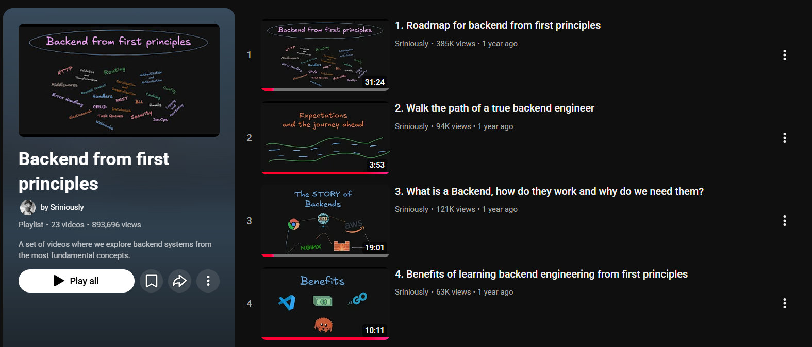

# Backend from First Principles

Notes and walkthroughs that explain how backend systems work — starting from the fundamentals, not from frameworks or buzzwords.

This repository is a personal learning project: each document breaks down one idea in plain language, with diagrams and step-by-step flows you can revisit anytime.

---

## Start here

| Topic | Document |
|-------|----------|
| **What happens when you visit a website?** (DNS → TCP → firewall → TLS → reverse proxy → backend → response) | [**Request to Response**](./RequestToResponse.md) |

That first write-up follows the path of a single request: from typing a URL in the browser to seeing the page come back. It is a good entry point before diving into HTTP, APIs, and application code.

---

## What this repo will grow into

Over time, this repository will add more notes aligned with the playlist roadmap — for example HTTP in depth, handlers, middleware, databases, caching, auth, and operations. Each file should stay readable on its own, like a short chapter.

---

## Inspiration & credit

These notes were created while following the excellent YouTube playlist **[Backend from first principles](https://www.youtube.com/playlist?list=PLui3EUkuMTPgZcV0QhQrOcwMPcBCcd_Q1)** by **[Sriniously](https://www.youtube.com/@Sriniously)**.

The playlist walks through HTTP, routing, middleware, databases, security, DevOps, and more — all from the ground up. If you want the full video journey, start there:

**[Watch the playlist on YouTube →](https://www.youtube.com/playlist?list=PLui3EUkuMTPgZcV0QhQrOcwMPcBCcd_Q1)**

> *Screenshot of the playlist — click the image to open it on YouTube.*

**Thank you, Sriniously**, for making backend engineering approachable and teaching it from first principles. This repo exists because of that work; all credit for the curriculum and teaching belongs to the channel.

---

## License & attribution

- **Teaching source:** [Backend from first principles](https://www.youtube.com/playlist?list=PLui3EUkuMTPgZcV0QhQrOcwMPcBCcd_Q1) by Sriniously on YouTube.
- **This repo:** Personal study notes; not affiliated with or endorsed by the channel unless stated otherwise.

If you are Sriniously (or represent the channel) and want different attribution wording, open an issue or reach out — happy to adjust.
